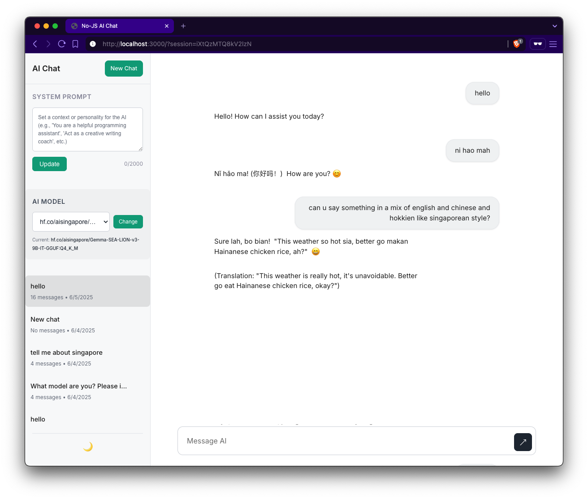

# No-JS AI Chat

A web-based AI chat application that operates without client-side JavaScript, using local AI models through Ollama.

## Overview

This application provides a chat interface for AI conversations while eliminating client-side JavaScript dependencies. By avoiding client-side JavaScript, it eliminates XSS vulnerabilities, works in restricted environments where JavaScript is disabled, and provides universal browser compatibility without requiring build processes or client-side frameworks.

The application uses server-side rendering with EJS templates, processes AI responses through local Ollama models, and implements polling-based updates for response handling. All data processing occurs locally without external API calls.

## Screenshot



*The No-JS AI Chat interface showing a live conversation with the AI assistant. The screenshot demonstrates the system prompt functionality, user message input, and a comprehensive AI response about Node.js with formatted markdown content including lists and bullet points - all working without client-side JavaScript.*

## Table of Contents

- [Overview](#overview)
- [Features](#features)
- [Architecture](#architecture)
- [Limitations](#limitations)
- [Technology Stack](#technology-stack)
- [Setup Instructions](#setup-instructions)
- [Local Development Guide](#local-development-guide)
- [Potential enhancements for secure environments](#potential-enhancements-for-secure-environments)

## Features

- **No client-side JavaScript required** - Functions with JavaScript disabled
- **Local AI processing** - Uses Ollama for AI model execution
- **Session management** - Multiple conversation threads with history
- **Theme switching** - Light/dark mode support
- **Markdown rendering** - Formatted AI responses with code highlighting
- **Rate limiting** - Configurable request throttling
- **Health monitoring** - System status endpoints
- **Docker support** - Containerised deployment option

## Architecture

```
┌─────────────────────────────────────────────────────────────────────────┐
│                           System Architecture                           │
├─────────────────────────────────────────────────────────────────────────┤
│                                                                         │
│  ┌─────────────┐    ┌────────────────────────────────┐    ┌──────────┐  │
│  │   Browser   │◄──►│         Node.js Server         │◄──►│ MongoDB  │  │
│  │             │    │                                │    │          │  │
│  │ • EJS Views │    │ ┌────────────────────────────┐ │    │ • Chats  │  │
│  │ • CSS Styles│    │ │    Security Middleware     │ │    │          │  │
│  │ • Meta Poll │    │ │ • Security Headers         │ │    │          │  │
│  │   Refresh   │    │ │ • Rate Limiting            │ │    │          │  │
│  │ • Form POST │    │ │ • Input Validation         │ │    │          │  │
│  └─────────────┘    │ └────────────────────────────┘ │    └──────────┘  │
│         │           │                                │                  │
│         │           │ ┌────────────────────────────┐ │                  │
│    ┌────▼────┐      │ │       Route Layer          │ │                  │
│    │ Meta    │      │ │ • Chat Routes (/)          │ │                  │
│    │ Refresh │      │ │ • Health Routes (/health)  │ │                  │
│    │ Polling │      │ │ • Session Routes           │ │                  │
│    │(3s)     │      │ │ • Utility Routes           │ │                  │
│    └─────────┘      │ └────────────────────────────┘ │                  │
│                     │                                │                  │
│                     │ ┌────────────────────────────┐ │                  │
│                     │ │    Service Layer           │ │                  │
│                     │ │ • Chat Service             │ │                  │
│                     │ │ • Ollama Service           │ │                  │
│                     │ └────────────┬───────────────┘ │                  │
│                     └────────────────────────────────┘                  │
│                                    │                                    │
│                                    ▼                                    │
│                              ┌─────────────┐                            │
│                              │   Ollama    │                            │
│                              │             │                            │
│                              │ • LLaMA 3.2 │                            │
│                              │ • Mistral   │                            │
│                              │ • Other     │                            │
│                              │   Models    │                            │
│                              └─────────────┘                            │
│                                                                         │
├─────────────────────────────────────────────────────────────────────────┤
│ Communication Flow:                                                     │
│                                                                         │
│ 1. User submits message via HTML form POST                              │
│ 2. Server validates input and processes request                         │
│ 3. Chat service stores message and calls Ollama API                     │
│ 4. AI response generated and stored in MongoDB                          │
│ 5. Response rendered server-side with markdown processing               │
│ 6. Meta refresh redirects to check processing status                    │
│ 7. Polling continues until response completion                          │
│                                                                         │
│ Update Mechanisms:                                                      │
│ • Meta refresh polling every 3 seconds (works without JavaScript)       │
│ • Form-based interactions for message submission                        │
│ • Server-side rendering with EJS templates                              │
└─────────────────────────────────────────────────────────────────────────┘
```

## Limitations

### Streaming Constraints

Real-time token streaming is not possible without JavaScript due to technical limitations:

**Why streaming requires JavaScript:**
- Token-by-token updates need `EventSource` API or `fetch()` streams
- DOM manipulation for progressive text insertion requires JavaScript
- HTTP is request-response based, not suitable for continuous data flow
- Browser event handling for server-push requires JavaScript event listeners

**Current approach:**
- Complete responses are generated server-side before display
- Polling mechanism checks for response completion
- Loading indicators provide user feedback during processing
- Server-Sent Events available when JavaScript is enabled for better UX

### Other Limitations

- **Response time** - No progressive display means users wait for complete responses
- **Browser compatibility** - Meta refresh polling may feel slow in some browsers
- **Resource usage** - Polling creates additional server requests
- **Limited real-time features** - No typing indicators or live status updates without JavaScript

## Technology Stack

### Backend

**Node.js + Express.js**
- Asynchronous I/O for handling concurrent requests
- Middleware ecosystem for security and functionality
- Server-side rendering eliminates client-side dependencies

**MongoDB + Mongoose**
- Document-based storage for chat messages and sessions
- Flexible schema for conversation history
- Built-in connection pooling and query optimisation

**EJS Templates**
- Server-side HTML generation
- Template inheritance and partials
- Built-in XSS protection through automatic escaping

### Frontend

**CSS + HTML**
- Standards-based styling without build tools
- Responsive design using CSS Grid and Flexbox
- Theme system with CSS custom properties

**Update Mechanisms**
- Meta refresh for JavaScript-free polling
- Server-Sent Events for enhanced experience with JavaScript
- Form-based interactions using standard HTTP methods

### AI Integration

**Ollama**
- Local AI model execution
- REST API for model communication
- Support for various models (LLaMA, Mistral, etc.)

**Markdown Processing**
- Server-side rendering with Marked library
- DOMPurify for XSS protection
- Syntax highlighting for code blocks

## Setup Instructions

### Prerequisites

- Node.js v18+
- MongoDB v6.0+
- Ollama
- Git

### Docker Setup

1. **Clone repository**
```bash
git clone https://github.com/horensen/no-js-ai.git
cd no-js-ai
chmod +x docker-setup.sh
```

2. **Configure environment**
```bash
cp docker.env.example docker.env
# Edit docker.env with your settings
```

3. **Install Ollama**

macOS:
```bash
brew install ollama
brew services start ollama
ollama pull llama3.2
```

Linux:
```bash
curl -fsSL https://ollama.ai/install.sh | sh
sudo systemctl start ollama
ollama pull llama3.2
```

Windows:
```bash
# Download from https://ollama.ai/
ollama serve
ollama pull llama3.2
```

4. **Start services**
```bash
./docker-setup.sh start
```

5. **Access application**
- Application: http://localhost:3000
- Health check: http://localhost:3000/health

### Manual Setup

1. **Install dependencies**
```bash
git clone https://github.com/horensen/no-js-ai.git
cd no-js-ai/backend
npm install
```

2. **Setup MongoDB**
```bash
# Local installation
mongod --dbpath ./data/db

# Or configure MongoDB Atlas connection string
```

3. **Configure environment**
```bash
cp backend/env.example backend/.env
# Edit .env file with your configuration
```

4. **Start development server**
```bash
cd backend
npm run dev
```

## Local Development Guide

### Project Structure

```
no-js-ai/
├── backend/
│   ├── src/
│   │   ├── config/          # Database configuration
│   │   ├── middleware/      # Express middleware
│   │   ├── models/          # MongoDB schemas
│   │   ├── routes/          # Route handlers
│   │   ├── services/        # Business logic
│   │   ├── utils/           # Helper functions
│   │   └── server.js        # Application entry point
│   ├── tests/               # Test suites
│   └── package.json         # Dependencies
├── frontend/
│   ├── public/css/          # Stylesheets
│   └── views/               # EJS templates
├── docker-compose.yml       # Container orchestration
├── Dockerfile              # Container definition
└── README.md               # Documentation
```

### Development Commands

```bash
# Start development server
npm run dev

# Run tests
npm test

# Run tests with coverage
npm run test:coverage

# Run tests in watch mode
npm run test:watch
```

### Testing

- Unit tests for all components
- Integration tests for API endpoints
- MongoDB Memory Server for isolated testing
- Jest framework with coverage reporting

### Environment Variables

```bash
# Application
NODE_ENV=development
PORT=3000

# Database
MONGODB_URI=mongodb://localhost:27017/no-js-ai

# AI Service
OLLAMA_URL=http://localhost:11434
OLLAMA_MODEL=llama3.2

# Security
SESSION_SECRET=your-session-secret
RATE_LIMIT_ENABLED=true

# Features
STREAMING_ENABLED=true
MAX_MESSAGE_LENGTH=4000
```

## Potential enhancements for secure environments

The following improvements would significantly enhance the application's value for users operating in high-security, restricted, or air-gapped environments:

| Enhancement | Key Features | Benefits | Example Use Case |
|-------------|--------------|----------|------------------|
| **Document Upload & Analysis** | • Secure file processing for PDFs, Word docs, spreadsheets<br>• OCR for scanned documents and images<br>• Drag-and-drop interface (works without JavaScript)<br>• Automatic content extraction and summarisation<br>• Support for technical diagrams and charts | • **Direct File Analysis**: Upload documents for AI review without copy-pasting<br>• **Time Saving**: Instant document summarisation and key point extraction<br>• **Accessibility**: OCR makes scanned documents searchable and analysable | Legal teams uploading contracts for clause analysis. Engineers uploading technical manuals for troubleshooting guidance. Researchers analysing academic papers and extracting key findings. |
| **Conversation Templates** | • Pre-built templates for common tasks<br>• Industry-specific conversation starters<br>• Customisable prompt libraries<br>• Quick-action buttons for frequent requests<br>• Template sharing within teams | • **Faster Onboarding**: New users can start immediately with proven templates<br>• **Consistency**: Standardised approaches across teams<br>• **Productivity**: Skip repetitive prompt writing with one-click templates | Incident response teams using cybersecurity templates. Code reviewers using software analysis templates. Content creators using writing and editing templates. |
| **Advanced Search & Filtering** | • Full-text search across all conversations<br>• Filter by date, topic, AI model used<br>• Tag and categorise conversations<br>• Export filtered results to reports<br>• Smart suggestions based on search history | • **Knowledge Retrieval**: Quickly find previous AI insights and solutions<br>• **Information Management**: Organise conversations for easy reference<br>• **Team Learning**: Discover solutions from colleagues' conversations | Support teams finding previous troubleshooting solutions. Analysts retrieving past research insights. Project managers tracking decision-making conversations across multiple initiatives. |
